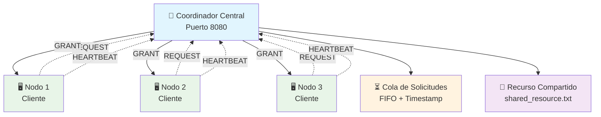
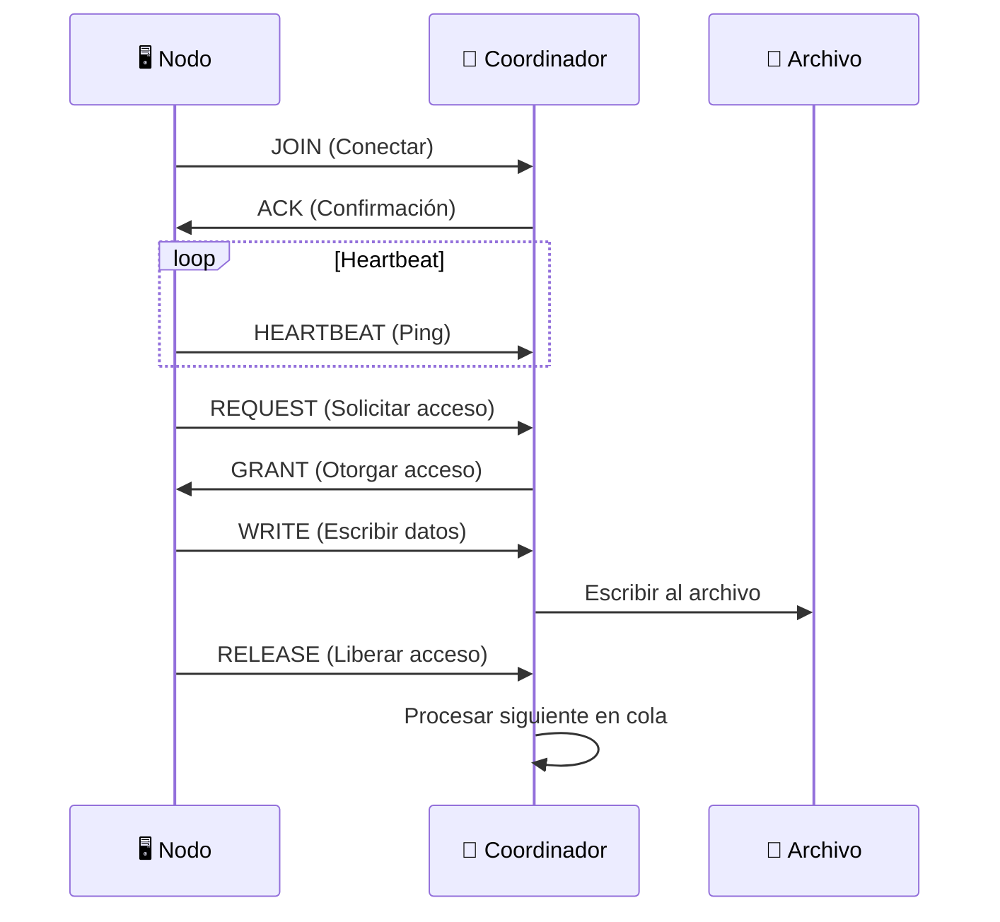

# 🔐 Sistema de Exclusión Mutua Distribuida

<div align="center">


**🚀 Sistema distribuido para coordinar el acceso exclusivo a recursos compartidos**

[Características](#-características) • [Instalación](#-instalación) • [Uso](#-uso) • [Arquitectura](#-arquitectura) • [Ejemplos](#-ejemplos)

</div>

---

## 📋 Tabla de Contenidos

- [🌟 Características](#-características)
- [🏗️ Arquitectura](#️-arquitectura)
- [⚙️ Instalación](#️-instalación)
- [🚀 Uso](#-uso)
- [📊 Ejemplos de Uso](#-ejemplos-de-uso)
- [🔧 Comandos Disponibles](#-comandos-disponibles)
- [🌐 Protocolo de Comunicación](#-protocolo-de-comunicación)
- [📁 Estructura del Proyecto](#-estructura-del-proyecto)
- [🔍 Monitoreo](#-monitoreo)
- [🤝 Contribución](#-contribución)
- [📄 Licencia](#-licencia)

---

## 🌟 Características

<table>
<tr>
<td align="center">

<br>
<strong>Exclusión Mutua</strong>
<br>
Garantiza acceso exclusivo a recursos compartidos
</td>
<td align="center">

<br>
<strong>Reloj Lógico</strong>
<br>
Sincronización basada en algoritmo de Lamport
</td>
<td align="center">

<br>
<strong>Sistema Distribuido</strong>
<br>
Múltiples nodos coordinados centralmente
</td>
</tr>
<tr>
<td align="center">

<br>
<strong>Monitoreo Activo</strong>
<br>
Detección automática de nodos inactivos
</td>
<td align="center">

<br>
<strong>Auditoría Completa</strong>
<br>
Registro detallado de todas las operaciones
</td>
<td align="center">

<br>
<strong>Interfaz Interactiva</strong>
<br>
Menús de comandos intuitivos
</td>
</tr>
</table>

---

## 🏗️ Arquitectura



### 🔄 Flujo de Operaciones

1. **🔗 Conexión**: Los nodos se conectan al coordinador
2. **📨 Solicitud**: Nodo solicita acceso a la sección crítica
3. **⏳ Cola**: Solicitud se añade a la cola ordenada por timestamp
4. **🔒 Acceso**: Coordinador otorga acceso al primer nodo en cola
5. **📝 Operación**: Nodo realiza operaciones en el recurso compartido
6. **🔓 Liberación**: Nodo libera el acceso al terminar
7. **🔄 Repetir**: Proceso continúa con el siguiente nodo en cola

---

## ⚙️ Instalación

### 📋 Requisitos

- **Go 1.21+** 
- **Sistema operativo**: Windows, Linux, macOS
- **Puertos**: 8080 (configurable)

### 🛠️ Pasos de Instalación

```bash
# 1. Clonar el repositorio
git clone https://github.com/NixSpawn/exclusion-mutua.git
cd exclusion-mutua

# 2. Inicializar módulo Go
go mod init exclusion-mutua

# 3. Compilar (opcional)
go build -o coordinator/coordinator coordinator/main.go
go build -o node/node node/main.go
```

---

## 🚀 Uso

### 1️⃣ Iniciar el Coordinador

```bash
# Ejecutar coordinador
go run coordinator/main.go
```

**Salida esperada:**
```
🌐 === COORDINADOR DE EXCLUSIÓN MUTUA DISTRIBUIDA ===
Puerto: 8080
================================================
🚀 Coordinador iniciado en puerto 8080
💡 Ejecute nodos con: go run node/main.go <node_id>

🎮 === MENÚ DEL COORDINADOR ===
Comandos disponibles:
  status - Mostrar estado del sistema
  log    - Mostrar log de accesos
  file   - Mostrar contenido del archivo
  quit   - Salir

Coordinador> 
```

### 2️⃣ Conectar Nodos

```bash
# Terminal 1
go run node/main.go Node1

# Terminal 2
go run node/main.go Node2

# Terminal 3
go run node/main.go Node3
```

**Salida esperada:**
```
🚀 === NODO Node1 ===
Conectando al coordinador...
✅ Nodo Node1 conectado al coordinador

🎮 === MENÚ DEL NODO Node1 ===
Comandos disponibles:
  request        - Solicitar acceso a sección crítica
  write <texto>  - Escribir al recurso (solo en sección crítica)
  release        - Liberar sección crítica
  status         - Mostrar estado del nodo
  quit           - Salir

Nodo Node1> 
```

---

## 📊 Ejemplos de Uso

### 🔐 Escenario: Acceso Exclusivo a Archivo

```bash
# Nodo1 solicita acceso
Nodo Node1> request
🔄 Nodo Node1: Solicitando acceso a sección crítica
🔒 Nodo Node1: ACCESO OTORGADO - Ahora en sección crítica

# Nodo1 escribe al recurso
Nodo Node1> write Hola desde Node1
📝 Nodo Node1: Escribiendo 'Hola desde Node1' al recurso

# Nodo1 libera acceso
Nodo Node1> release
🔓 Nodo Node1: Liberando sección crítica
```

### 📈 Monitoreo del Sistema

```bash
# Ver estado del coordinador
Coordinador> status

📊 === ESTADO DEL COORDINADOR ===
Reloj lógico: 15
Clientes conectados: 3
Solicitudes en cola: 1
Titular actual: Node1

👥 Clientes:
  - Node1: En sección crítica (último ping: 14:32:15)
  - Node2: Libre (último ping: 14:32:14)
  - Node3: Libre (último ping: 14:32:13)

⏳ Cola de solicitudes:
  1. Node2 (timestamp: 12)
```

---

## 🔧 Comandos Disponibles

### 👑 Comandos del Coordinador

| Comando | Descripción | Ejemplo |
|---------|-------------|---------|
| `status` | 📊 Mostrar estado completo del sistema | `Coordinador> status` |
| `log` | 📋 Mostrar registro de accesos | `Coordinador> log` |
| `file` | 📄 Mostrar contenido del archivo compartido | `Coordinador> file` |
| `quit` | 👋 Cerrar coordinador | `Coordinador> quit` |

### 🖥️ Comandos del Nodo

| Comando | Descripción | Ejemplo |
|---------|-------------|---------|
| `request` | 🔄 Solicitar acceso a sección crítica | `Nodo1> request` |
| `write <texto>` | 📝 Escribir al recurso compartido | `Nodo1> write Mi mensaje` |
| `release` | 🔓 Liberar sección crítica | `Nodo1> release` |
| `status` | 📊 Mostrar estado del nodo | `Nodo1> status` |
| `quit` | 👋 Desconectar nodo | `Nodo1> quit` |

---

## 🌐 Protocolo de Comunicación

### 📨 Tipos de Mensaje

```json
{
  "type": "REQUEST|GRANT|RELEASE|HEARTBEAT|JOIN|LEAVE|WRITE",
  "node_id": "Node1",
  "timestamp": 1234567890,
  "content": "Mensaje descriptivo"
}
```

### 🔄 Secuencia de Comunicación



---

## 📁 Estructura del Proyecto

```
distributed-mutex/
├── 📁 coordinator/
│   ├── 🏢 main.go                  # Coordinador central
│   └── 📄 shared_resource.txt      # Recurso compartido (generado)
├── 📁 node/
│   └── 🖥️ main.go                  # Cliente nodo
├── 📁 tmp/
│   └── 🗑️ main.exe                 # Ejecutables temporales
├── 📄 go.mod                       # Dependencias Go
├── 📄 .gitignore                   # Archivos ignorados
└── 📄 README.md                    # Este archivo
```

---

## 🔍 Monitoreo

### 📊 Métricas del Sistema

- **⏰ Reloj lógico**: Sincronización temporal
- **👥 Clientes activos**: Nodos conectados
- **⏳ Cola de solicitudes**: Peticiones pendientes
- **🔒 Titular actual**: Nodo con acceso exclusivo
- **💓 Heartbeat**: Última actividad de cada nodo

### 🚨 Detección de Fallos

- **Timeout de heartbeat**: 10 segundos
- **Reconexión automática**: En desarrollo
- **Limpieza de recursos**: Automática al desconectar

---

## 🤝 Contribución

### 🛠️ Mejoras Futuras

- [ ] 🔄 Reconexión automática de nodos
- [ ] 📊 Métricas en tiempo real
- [ ] 🌐 Interfaz web de administración
- [ ] 🔐 Autenticación y autorización
- [ ] 📈 Análisis de rendimiento
- [ ] 🎯 Balanceador de carga

### 📝 Guía de Contribución

1. **🍴 Fork** el repositorio
2. **🌿 Crear** una rama para tu feature
3. **💻 Desarrollar** y probar los cambios
4. **📝 Documentar** las modificaciones
5. **🚀 Enviar** pull request

---

<div align="center">

**🌟 ¡Gracias por usar nuestro sistema de exclusión mutua distribuida! 🌟**

[](https://github.com/tu-usuario/distributed-mutex)
[](https://github.com/tu-usuario/distributed-mutex/issues)
[](https://github.com/tu-usuario/distributed-mutex/issues)

</div>